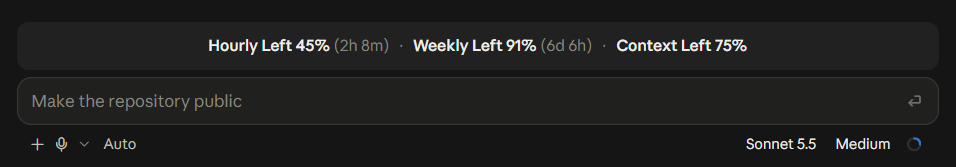

# sourav-claude-mods

Claude Code mods by Sourav.

## Mods

### limits-band

A bar above the prompt that shows what is left of your limits:



- Percent turns red below 20%.
- The bracket shows time until that limit resets.
- Hourly and weekly limits are shared between sessions, so every chat shows the freshest reading any session has seen, even before its own first reply.
- Needs a Claude subscription plan. On API billing, only context shows.

## Install

```bash
claude plugin marketplace add sourav-das-enosis/sourav-claude-mods
claude plugin install limits-band@sourav-claude-mods
```
